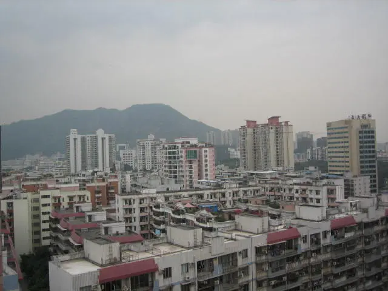

星期三到了深圳，还住在海湾酒店。价格合适，又有宽带，和他还有患难之交，2003年非典时不能回去，在这里住了一个月。

酒店在蛇口，附近有四海公园，穿过公园还有一个我经常去吃吃饭的陕西风味，就在蛇口体育场旁边，这家已经开了有6,7年了，依然很红火。

在深圳南油待了5年，一直没有感觉这是我要呆下去的地方，一是因为四季不分，二是太热，三是没有融入深圳，没有归属感。蛇口是个适合人居住的地方，虽然有不少的工厂，很多打工仔，毕竟让人感觉是个可以生活的地方。第一次吃汉堡也是在蛇口，最喜欢的是猪柳蛋。酒店往北原来的滩涂地带，已经开发成片的居住区，高楼林立，一个一个的小窗户让人感到压抑。想当年这里还是海滩，还有武警不时的巡逻。

香港回归的前一天晚上，还在和这里的武警中队打过交道，因为有同事没带暂住证，在这里的海边溜达，让这里的警惕性极高武警战士扣住了，打电话给我，帮忙给他拿证件，出单位证明，陪着他写检查接受武警的教育。
