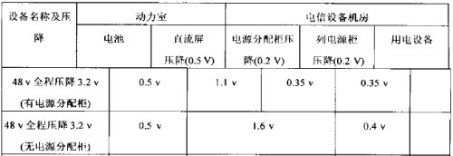

查询了网站的统计信息，发现搜索电力线缆计算方法的还不少，我根据以往经验，参照其他人写的文章，归纳了一下，供大家参考。

对于小工程来说，或者一个工程的配套部分，电源头柜至电源分支柜或直流屏这段导线的线径可按照固定压降发，根据以下公式计算，其计算公式如下：

S=(ΣIL)/(rΔU)

上式中： - S — 导线截面面积(mm2)，

    ΣI — 流过导线的电流(A)，实际上是头柜允许的最大电流，

    L — 导线回路长度(m),注意，是回路，即一来一回的长度，

    r — 导体导电系数(m/Ω·mm2)，一般铜取57，铝取34，

    ΔU — 除掉配电设备等压降后在导线上允许的压降(V)。

现在要确认的是ΔU的数值，ΔU根据不同的电源系统设计，取值也不同，需向电源专业了解ΔU的取值，如果了解不到，可以按以下直流放电回路全程压降分配的情况取定。（要注意的是，这种分配方法只是其中的一种，还有其他的方法）

按此算出电力线线径，并向上取相近的电缆规格，保护地可取小一号线径。

在不同机房之间选用铜芯聚氯乙烯绝缘聚氯乙烯护套电力电缆（阻燃）（RVVZ系列），在同一机房内选用铜芯聚氯乙烯绝缘电力电缆（阻燃）（RVZ系列）。

设计中常见的直流用电力线按截面分有如下几种：1×6、1×10、1×16、1×35、1×50、1×70、1×95、1×120、1×150、1×185、1×240（mm2）。
