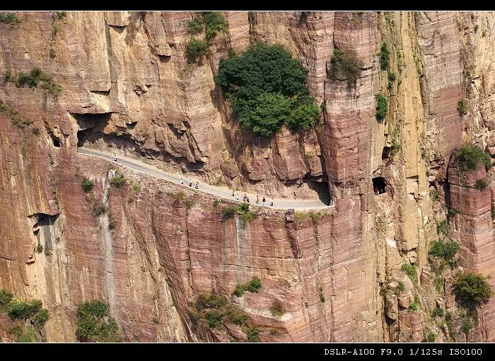

五一黄金周没有出去，在家过了7天“猪”一样的生活。由于十一后要去安哥拉一段时间，借着这个机会全家去游玩一下。

出去游玩不愿受拘束，不愿象走马灯一样去旅游，因此，这次还是自助游，全程坐长途客车和包车。

去之前上网查了查，决定去郭亮看看。一是据说风景不错，二是离家也近。

先附一张照片吧。（郭亮洞，悬崖上开凿的公路）

后记：

这是一篇未完成的游记。节后就去了安哥拉，当时是只是以为”要去安哥拉一段时间“，但一是世事难料，二是领导的话不能信，在安哥拉前后待了三年。
