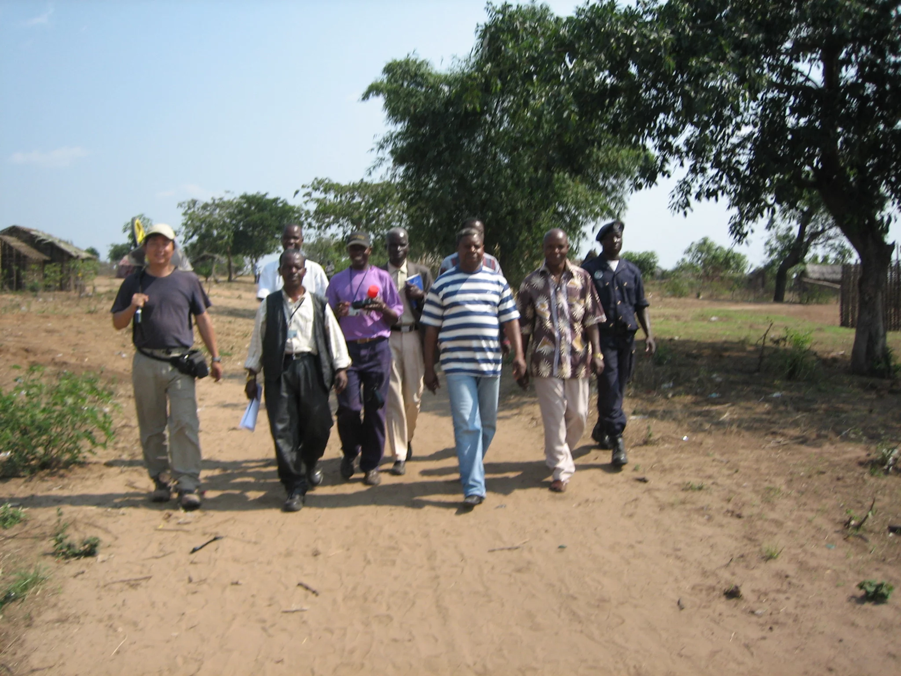

9月10日到9月22日，我们工程组对UIGE省几个地级市进行查勘，说是地级市，其实甚至比中国的一个县镇的规模还小。

威热省位于安哥拉东北，与本哥省、北广萨省、马兰哲省、扎伊尔省等省份及刚果民主共和国相邻。有原始森林和热点灌木草原覆盖，同时也是各种怪病的多发区，如昏睡病，马尔堡等。

由于战争，很多道路路面上弹坑累累，车辆只能压着路沿慢速形式，不过还得承认，那些战争没有破坏的道路，虽然30多年没有维修，路面依然完好，几乎没有沉降和开裂的迹象。我们查勘所走的路，由于山体滑坡，新开了一条土路，不下雨的时候还能开上去，如果下雨了，恐怕四驱都难上，这种土遇水变得很滑。

在SANTA CRUZ小镇查勘，从主路到这个镇约30公里的山路，来回6个小时，平均每小时10公里，不过，这不算最差的路。这个镇子交通不便，估计很少有外国人来，估计中国人也就我们是第一次到这里了。查勘的时候，“几大班子”的人都跟着陪同，有管行政的市长，还有估计是什么委员会的，还有警察局的头，还有MPLA党委的头，一大群人，场面还真隆重，足见这个工程在当地的重要地位。查勘前后半个小时，比花在路上的时间少多了。

在路上，我们一般是不停下来吃午饭的，一是赶时间，二也是没太多的东西可吃，也就吃些香蕉和饼干之类的。查完SANTA CRUZ回来的路上，当地政府的人去村里抓鸡，我们顺便吃了次午饭，这还真的留记忆的。饭很简单，面包加火腿肠，再配点咸菜。面包是2天前在UIGE市买的，下面的地方面包很少，木薯粉多，但据说在云南木薯都是当饲料的。黑人吃的也是面包，然后是鱼罐头和香肠罐头，不过鱼罐头有些腥味，香肠罐头看着有些油腻。

看来，我们真的与安哥拉人民同甘共苦了！
