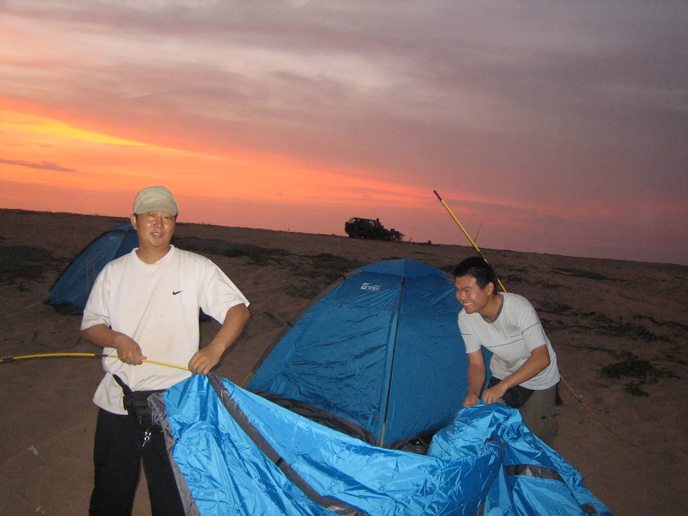
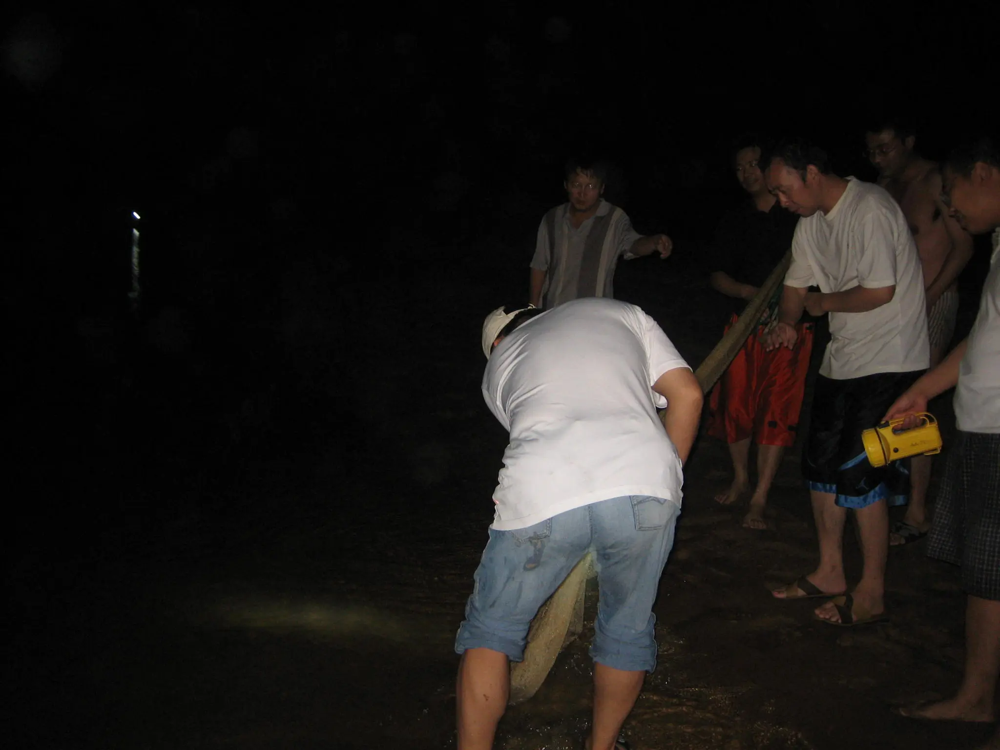
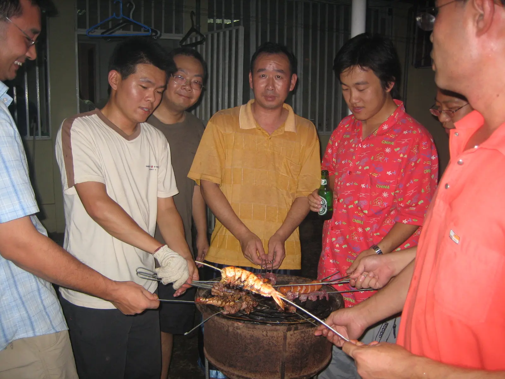
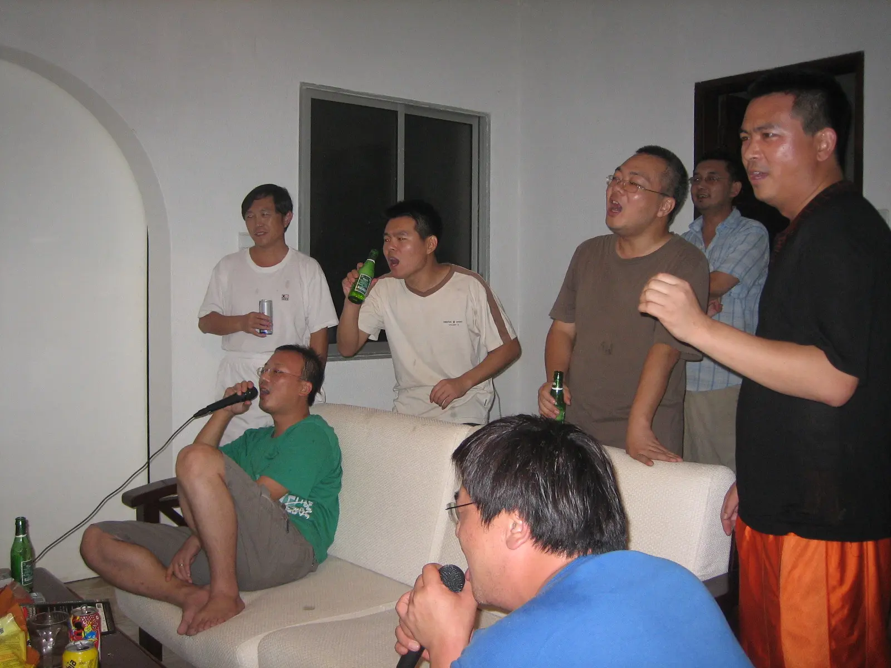

提起安哥拉，人们往往会想到战争、饥饿和疾病，仿佛这里是一个贫穷落后的可怕的地方，在这里生活完全没有乐趣。其实，当你置身在其中就会感到并非如此，我们在这里一年多的时间也能苦中作乐，寻找到各种手段丰富我们的业余生活。

宽扎河，安哥拉的母亲河，全长965公里，在首都LUANDA以南48公里处汇入大西洋。由于河水携带大量的有机物流入大海，宽扎河口可是一个钓鱼的好地方,同时，这里也有大片平坦的沙滩，适合晚上露营。我们一般是周六下午出发到宽扎河口，夜钓一晚，第二天早上返回。

夕阳西下，我们动手搭起了帐篷，这可是我第一次在大西洋的海边露营，还真是很兴奋呢。在我们忙着工作时，远处也有一伙安哥拉本地人开着越野车来钓鱼，还带来了烤炉准备现钓现烤。过了一会，又有人开车来宿营，是一家五口，其中还有个正在吃奶的婴儿，看来，安哥拉人还是挺会享受生活的。

垂钓是一个人的事情，顶多一群人围在一起默默看着河面。而在河边宿营的重头戏当然非捕鱼莫属了，别看捕鱼是由一个人来撒网，可是在一边做辅助工作的人倒挺多，有提桶装鱼的，有打手电筒照亮的，更多的人是喜欢当“教练”，在一旁指手划脚地指导捕鱼人撒网的动作，可是当轮到当教练的人亲自撒网时，不是渔网缠到一起，就是半条鱼都没打到，让人不仅想到中国有句老话叫纸上谈兵。
不过，对于我们这些从没捕鱼经历的人来说，关键在于亲身体验一下捕鱼的乐趣，鱼网里收获的多少并没影响大家捕鱼的劲头。也许是河口的鱼多，或者是歪打正着，撒网捕的鱼比钓到鱼又多又大。很晚了很多人还感觉意犹未尽，据说，有人还撒网捕鱼一直到清晨。

第二天早上，我们满载这这次来安哥拉首次露营的战利品“鱼儿”回归驻地。安哥拉当地蔬菜水果是物以稀为贵，我们这些在国内素食为主的人在这里也不得不入乡随俗，在这里只能以肉类为主食了。这里做饭的主要燃料是木炭，因为树木多，容易就地取材，所以肉类一般都是烤着吃，我们也不例外，这次来个海鲜烧烤。烤炉很简单，也是就地取材，用废弃的汽车轮毂，再用钢条焊个架子就行了。调料很简单，只有盐，油，还有就是国内带来的极为珍贵的辣椒粉和孜然。除了钓的捕的鱼外，我们还买了些羊肉、鸡肉和小龙虾，虽然在安哥拉龙虾是很便宜的东西，但我们也很少有机会品尝，不过这一次我们可要放开肚子大吃一顿了。

安哥拉人非常喜欢聚会，每到周六晚上，有条件的家庭就会支起烤炉，用气球装扮房间，把音乐声音放到最大，有的甚至还请来乐队现场演奏，大家聚到一起吃吃喝喝，玩玩跳跳，一直会进行到凌晨三四点钟，我们可是深受其害。不过这次我们也和安哥拉人一样了，先是烧烤，然后敞开喉咙放声高歌，起码要在声音上压过隔壁正在进行的PARTY。

