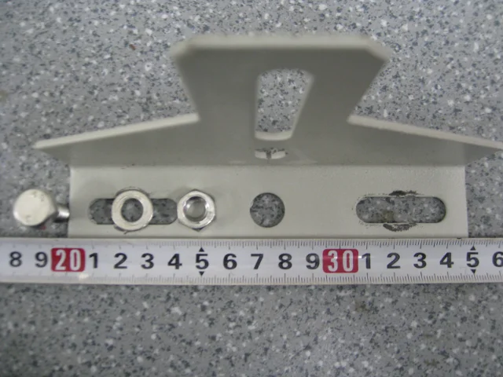
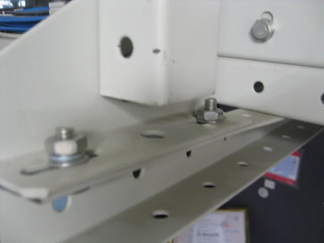
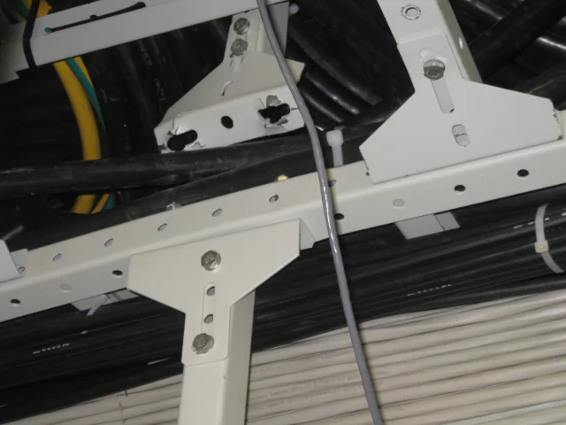
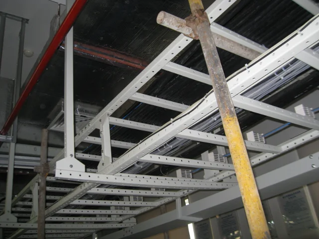
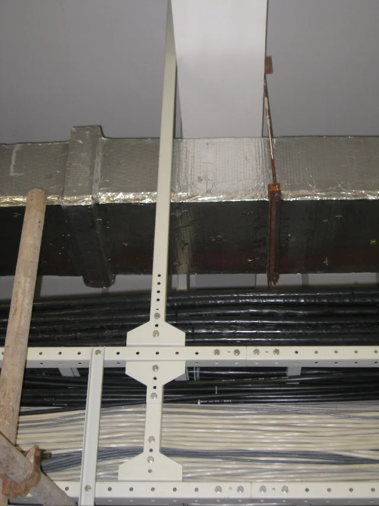
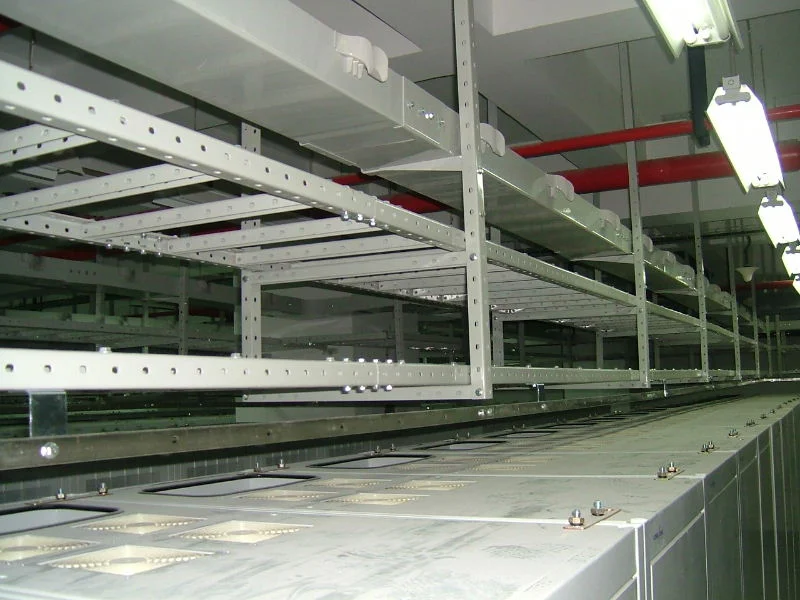
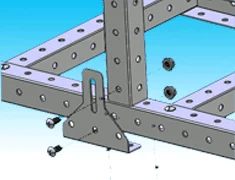

某机房在敷设电力电缆的施工过程中，机房维护施工通道一侧的走线架（约9米）发生垮塌，经现场查勘、分析，初步判断为吊挂连接件的螺孔槽受压力作用变形并扩张，致使连接固定龙门架横梁以及走线架上梁的螺栓从螺孔槽中脱落，事件发生原因可以从以下几个方面考虑：

## 材料方面

从现场情况看，吊杆与天花板未脱落，吊杆亦未发生拉伸变形及断裂，可认为吊杆的强度是足够的，主要问题就在于吊杆与走线架的连接件上。

连接件作为连接与支持走线架的零件，受力要比走线架大得多，所使用材料强度应高于走线架所用材料的强度，从现场来看，所使用材料均为同一规格，厚度为2mm。按YD5026-95和YD/T5026-2005《电信机房铁架安装设计标准》的要求，所采用铁件一般为50x50x5mm。

从螺栓与连接件的紧固方式看，连接件的受力面积主要是螺栓垫片与连接件的接触面积，从照片上看，螺栓垫圈小，致使连接件单位面积受力过大，超过连接件的受力特性，造成了螺孔槽受压力作用变形并扩张。目前走线架所用螺栓规格为M6，规范要求的螺栓规格为M8和M10和M12，

## 地震及受力的影响

从512大地震以来，该地区陆续发生了大大小小的上百次的余震。大地震和余震产生地震波，使走线架上下及左右震动，长期处于一种不稳定状态。螺栓、螺母与连接件的紧固，是靠螺栓、螺母以及垫片与紧固件间的摩擦力固紧的，同时，由于部分螺母、螺栓安装时没有加弹簧垫圈（见下图），经过512大地震以及上百次余震的冲击波后，非常容易使螺母与螺栓松动。

走线架安装后，也经过了若干次的施工，在敷设电缆的过程中，走线架不是一个静态、缓慢受力的过程，而是受到线缆自重、拖拉线缆以及施工人员操作时产生的冲击力，这也会对螺栓螺母等紧固件产生影响，加速松动的过程。

螺栓、螺母与连接件间的松动，使得连接件间有了空隙，同时由于走线架重量的缘故，使得连接件螺栓槽有了变形的空间，一旦受到外界一定的冲击力，超过其承受程度，就会使得变形加速，造成走线架的脱落。

现场塌垮的走线架，是维护和施工通道一侧走线架发生侧翻，而不是走线架整体垮塌，在施工中，由于外力扰动，走线架受力不平衡，维护和施工通道一侧走线架连接件受力过大也是一个原因。

## 连接加固方式

现场走线架吊挂有两种方式，一种为龙门架，龙门架的横担支撑两层走线架的重量，另外一种为吊挂上层走线架梁上，如下图所示

按一般要求，对于双层走线架，每层都应与吊挂连接（见下图），以免连接件集中受力，现场的走线架只有最下一层与吊挂连接，导致所有线缆的重量都压在横梁上，也导致连接件的受力过大。

现场走线架另外一种的吊挂方式，这种方式致使只有连接件的螺栓受力，而整个连接件不受力，也会导致螺孔槽所受压力过大，以致变形，若连接件承托上梁下放，则受力为整个连接件以及螺栓（见下图）。

现场的走线架投入使用已多年，期间经历了512大地震以及前后若干次地震、施工布放线缆等，对走线架，尤其是连接件部位的可靠性、安全性产生了较大的影响，加上最后一次施工过程中产生外力的影响，以及吊挂件的材料与安装方式的不合理因素，导致此次事件的发生。同时，由于现场走线架是近年来采用新型材料，以往相关的规范未提及该种材料，还需对该种走线架应有的各项指标要求进行不断的实践和探索。

## 有关走线架的规范（注意：需核实规范的有效期）

 - YD 5026-1996《长途通信传输机房铁架槽道安装设计标准》（被YD/T 5026-2005替代）
 - YD 5059-98《通信设备安装抗震设计规范》（被YD 5059-2005替代）
 - YD 5060-1998《通信设备安装抗震设计图集》（被YD 5060-2010替代）
 - YD/T 5026-2005《电信机房铁架安装设计标准》
 - YD 5059-2005《电信设备安装抗震设计规范》
 - YD 5060-2010《通信设备安装抗震设计图集》
