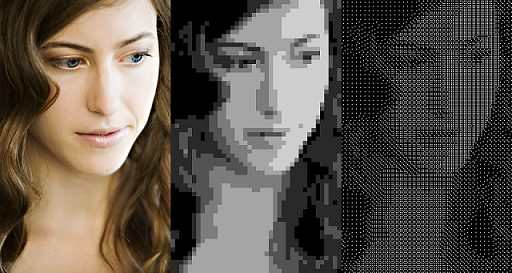
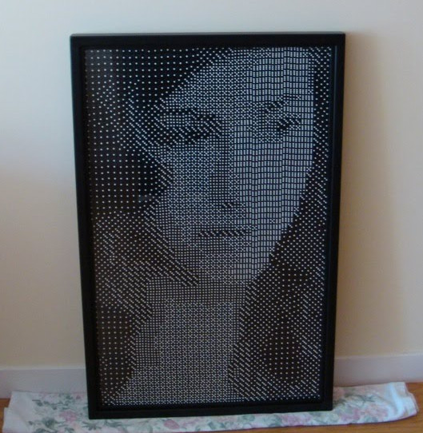
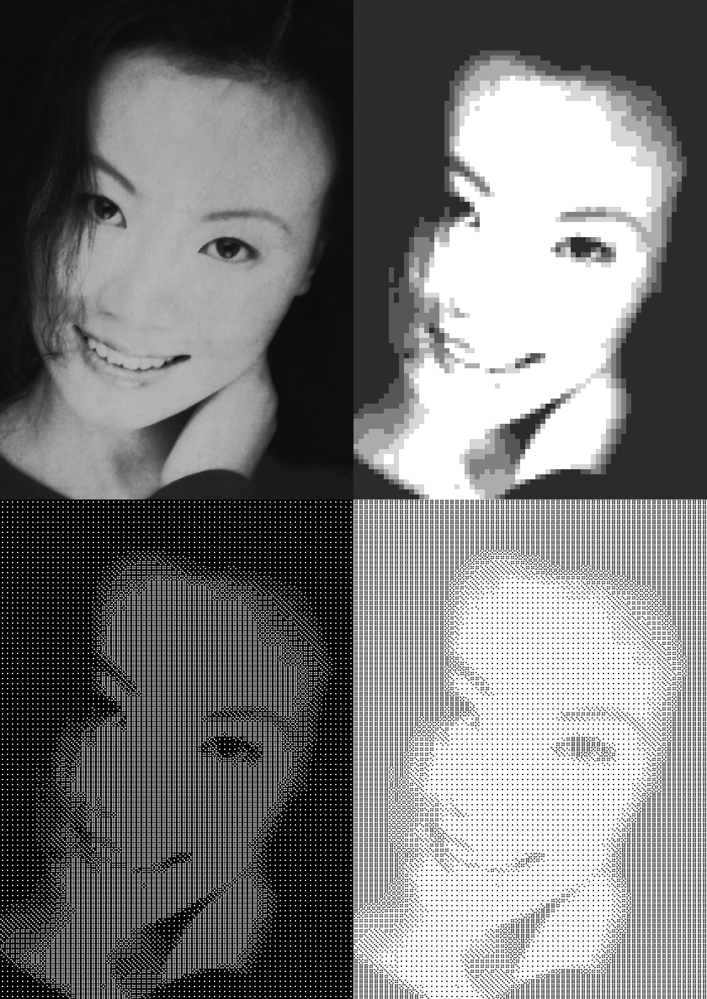
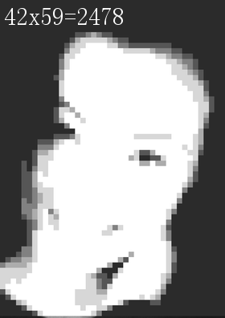
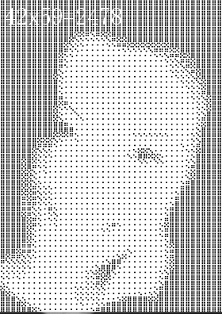
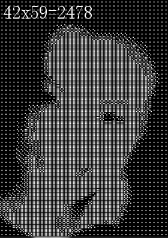
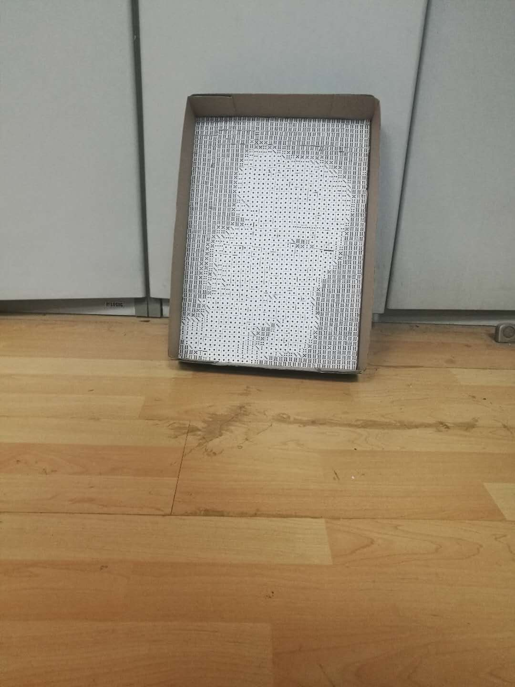
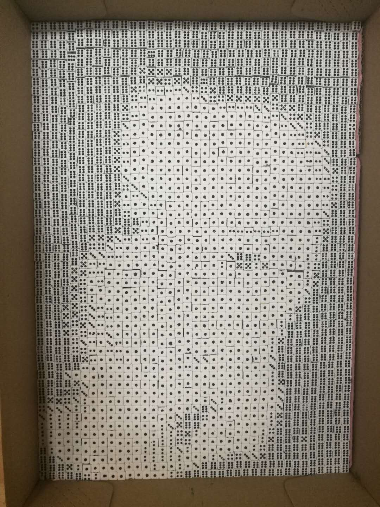

2008年Scott MacDonald发表了一篇Blog，用骰子为她制作一副肖像画,他把一幅肖像画量化成不同点数的色子，用色子摆放成了一幅肖像画。如下图：

他用了2560（40x60）个16mm的色子，制作了一个64cmx96cm的色子肖像，如下图：

他用的是Prossing语言编写的程序。近期正在学习Python，就尝试用Python来实现这一功能。

思路是先对图像进行灰度处理，然后把图片分割成16x16像素的单元图块，再对图块中256个点的灰度取平均值，对平均值分组用1-6数值代替。色度值范围0-255，亮度从深到浅，颜色从黑到白。数值1-6对应色子的点数，对于黑底白点的色子，色度值和点数正比例关系，对于白底黑点的色子，色度值和点数反比例关系。最后按色子点数做出图。

我用了三种16x16的图块，如下：

灰度色块：

黑底白点色子：

白底黑点色子：

利用Python的PIL库（Python Image Library）以及numpy数组库，能够很容易的完成功能。

首先是加载库文件，打开图片，对图片灰度处理，并计算要分割图块的数量

#加载库文件
>from PIL import Image, ImageDraw
>import numpy as np
#载入色子图片，1.png-6.png，代表色子点数
>dice =[]
>for i in range(6):
>    dice.append(Image.open(str(i+1)+'.png'))
#载入肖像图片
>im = Image.open("cecilia.png")
>im=im.convert("L")
>width,hight =im.size
>x_max = int (width/16)
>y_max = int(hight/16)

分割图片为16x16图块，并计算点的色度平均值

>image_data = np.ones(y_max*x_max).reshape(y_max,x_max)
>block_data = np.ones(16*16).reshape(16,16)
>dice_data = np.ones(y_max*x_max).reshape(y_max,x_max)
>for j in range(y_max):
>      for i in range(x_max):
>            b=im.crop( (i*16,j*16,(i+1)*16,(j+1)*16))#获得16x16图片
>            sum_x=0
>            for ii in range(16):
>                  for jj in range(16):
>                        block_data[jj,ii]=b.getpixel((ii,jj))
>            image_data[j,i]=int(np.mean(block_data))

根据色块的平均值分配色子图块：

#定义色度分组值
>p = [45,65,80,95,130,155]
>if (image_data[j,i]<p[0]):
>      n = 5
>elif (image_data[j,i]>=p[0]) and (image_data[j,i]<p[1]):
>      n = 4
>elif (image_data[j,i]>=p[1]) and (image_data[j,i]<p[2]):
>      n = 3
>elif (image_data[j,i]>=p[2]) and (image_data[j,i]<p[3]):
>      n = 2
>elif(image_data[j,i]>=p[3]) and (image_data[j,i]<p[4]):
>      n = 1
>else:
>      n = 0
>im.paste(dice[n],(i*16,j*16))
>dice_data[j,i] = n+1

这里p1p6是对0255的色度值划分到1-6的分组值。 生成处理后的图片，及显示图片

>im.save('small_ceciliaw.png')
>im.show()

将色子点数写入文件

>f = open('cecilia_dice_data.txt','wt')
>for y in range(y_max):
>      f.write((str(y+1)+':'))
>      for x in range(x_max):
>            f.write(str(dice_data[y,x])+',')
>      f.write('\n')
>f.close()

按以上方法生成了三种处理后的图片，第一个是原图，第二个是灰度色块，第三个是黑底白点，第四个是白底黑点。如下图：

所用原始图片的大小为1120x1584，一共生成色子数量为70x99=6930块,若用8mm的色子制作，大小为56cmx79.2cm。 亚洲人的面部没有欧洲人立体感强，选择照片时需挑选立体感强，色差比较鲜明的图片，这样，分辨率可以低一些，色子的数量可以减少一些。另外，1-6的分组值也需要进一步优化。下图是分辨率变化的情况。

这个项目正在进行中，等色子及图框到后再把制作的全过程展示一下。

续：

购买了2000个色子，用纸盒盖子做框，摆成一个肖像，远看效果好些

源代码放到了GitHub上，做了些改动，采用opencv做图像处理。
