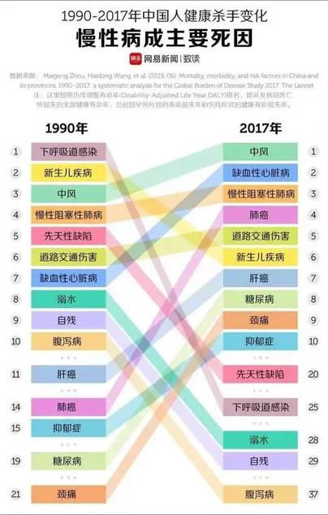
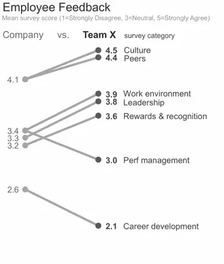
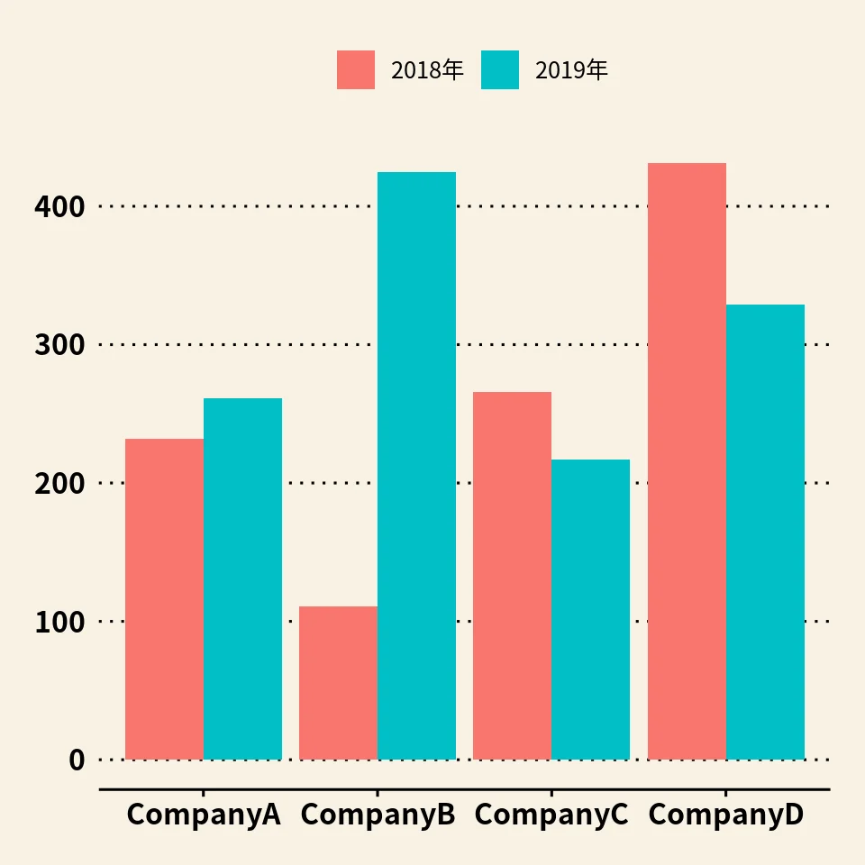
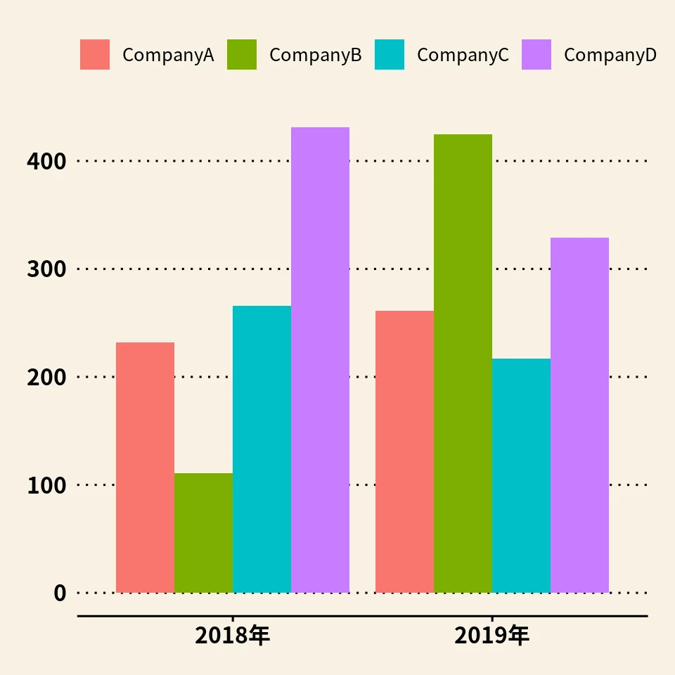
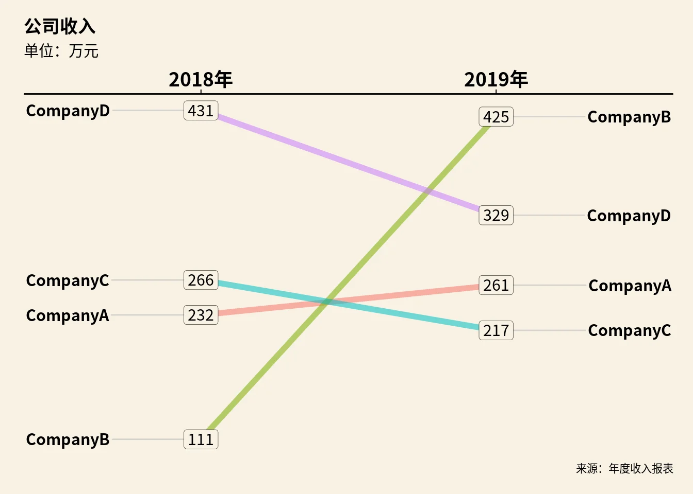

## 什么是斜线图

斜线图（Slopegraph）是一种用于展示同一组观测对象在两个固定状态之间变化关系的数据可视化形式。
这两个状态可以是不同时间（如今年与去年、事件前后），也可以是不同维度（如总体与子群体），其度量可以是排名、比例或数值。

从表现形式上看，斜线图属于折线图的一个特例，但其设计目标并不是描绘连续变化过程，而是强调两个状态之间的相对变化结构。因此，无论是 Excel、Tableau 还是 R，只要支持折线图的工具都可以绘制斜线图。

Edward Tufte 在 1983 年出版的《The Visual Display of Quantitative Information》中首次系统性讨论了这种表达方式，并在 2011 年 6 月 1 日的论坛中正式将其命名为 slopegraph。早期应用并不广泛，但随着数据新闻和分析型可视化的发展，斜线图近年来逐渐成为常用工具。

下面是几个典型的斜线图示例。


这是《Financial Times》绘制的一个斜线图，用于展示中国消费者对美国品牌商品抵制态度的变化情况。



这张图来自网易，X 轴为 1990 年和 2017 年两个时间点，Y 轴为慢性病伤残调整寿命年（DALY）的排名。通过斜线的交叉和排序变化，可以直观看出哪些慢性病在这 27 年间上升为主要死因，以及不同病种之间地位的变化。这种跨时间跨度较大的对比，正是斜线图**最典型**的应用场景。



该图引自 storytellingwithdata 网站的文章 More on slopegraphs。X 轴表示两个分组（Company 与 Team X），Y 轴表示调查指标得分。斜线图在这里用于展示同一指标在**总体与子群体**中的相对位置与变化情况。

## 什么时候用斜线图

Edward Tufte 在 6 月 1 日的帖子中对斜线图的用途做了高度概括：

>“Slopegraphs compare changes over time for a list of nouns located on an ordinal or interval scale.”

即：斜线图用于比较**一组可排序或可度量对象在不同状态之间的变化**。

因此，在原本会使用柱状图或折线图进行“两点对比”的场景中，斜线图往往是更高效的表达方式。例如，以下是用柱状图表示四家公司 2018 年和 2019 年收入的情况。
柱状图表示：



或者：



用斜线图表示，如下



对比这三种表达方式可以发现：
柱状图只能呈现绝对数值，而斜线图能够在同一视图中同时表达收入水平、排名以及变化幅度。读者不需要额外计算或比较，就可以理解企业之间的相对变化。

柱状图与斜线图在设计上的一个关键差异在于：柱状图的 Y 轴必须从 0 开始，否则会夸大差异；而斜线图的 Y 轴并不要求从 0 开始，因此更适合用来比较排名变化或相对变化结构，而不是绝对规模。

## 怎么用R语言作斜线图

由于斜线图就是折线图的一种变形，所以，只要能够制作折线图的软件都能制作斜线图，这里介绍一下在R语言环境下制作斜线图的方法。

GitHub有一个R语言库项目：CGPfunctions，提供了制作斜线图的函数newggslopegraph()。上面的斜线图就是用这个函数做出来的。

库文件的安装详见网页说明，最新版本是0.5.8，包含了新增加的一些函数参数，这里只把这个函数的参数用中文解释一下。

用法：

```
newggslopegraph(
  dataframe, Times, Measurement, Grouping,
  Title = "No title given", SubTitle = "No subtitle given",
  Caption = "No caption given", XTextSize = 12, YTextSize = 3,
  TitleTextSize = 14, SubTitleTextSize = 10, CaptionTextSize = 8,
  TitleJustify = "left", SubTitleJustify = "left",
  CaptionJustify = "right", LineThickness = 1, LineColor = "ByGroup",
  DataTextSize = 2.5, DataTextColor = "black",
  DataLabelPadding = 0.05, DataLabelLineSize = 0,
  DataLabelFillColor = "white", WiderLabels = FALSE,
  ReverseYAxis = FALSE, ReverseXAxis = FALSE, RemoveMissing = TRUE,
  ThemeChoice = "bw"
  )
```
参数：

  -  dataframe：一个数据框类型的数据组，tidy data格式。会检查一些基本的错误，如检查是否存在列名称。

  -  Times：数据框中的一列数据名，表示X轴上不同分组，比如时间或类别，可以是一个有序的class，因子或字符。注意，如果这列数据是日期类型，则需用as.character()转换成字符类型。

  -  Measurement： 数据框中的一列数据名，表示Y轴上不同的数值。一般为百分比、名次等，也可为数值，可接受的类型为整数或数值。如果数值不那么离散或集中，斜线图的表达会更完美。

  -  Grouping：分组名，数据框中的一列数据，表示不同的分组

例如上面例子中用的数据框为：

```
data

##    company   year income
## 1 CompanyA 2018年    232
## 2 CompanyA 2019年    261
## 3 CompanyB 2018年    111
## 4 CompanyB 2019年    425
## 5 CompanyC 2018年    266
## 6 CompanyC 2019年    217
## 7 CompanyD 2018年    431
## 8 CompanyD 2019年    329

```
这是一个带列名称的数据框data，第一列就是Grouping，表明每个斜线的类别，第二列是Times，表明X轴上的两个时间点，第三列是“Measurement”，表明每列别对应X轴在Y轴上的位置。

   - Title：标题，可选，当Title = NULL时，没有标题，当Title = “”时，一个空标题，但在图形中占据位置。

   - SubTitle：副标题，可选，当SubTitle = NULL时，没有标题，当SubTitle = “”时，一个空标题，但在图形中占据位置。

   - Caption：说明文字，可选，当Caption = NULL时，没有标题，当Caption = “”时，一个空标题，但在图形中占据位置。

   - XTextSize：X轴分组的文字大小，可选，缺省大小为12，和Y轴的分组文字大小有不同比例。

   - YTextSize：Y轴分组的文字大小，可选，缺省大小为3，和X轴的分组文字大小有不同比例。

   - TitleTextSize：标题文字大小，可选，缺省大小为14。

   - SubTitleTextSize：副标题文字大小，可选，缺省大小为10。

   - CaptionTextSize：说明文字大小， 可选，缺省大小为8。

   - TitleJustify：标题位置，为“L”, “R” or “C” or use the hjust = notation from ggplot2 with a numeric value between ‘0’ (left) and ‘1’ (right)。

   - SubTitleJustify：副标题位置，为“L”, “R” or “C” or use the hjust = notation from ggplot2 with a numeric value between ‘0’ (left) and ‘1’ (right)。

   - CaptionJustify：说明文字位置，为“L”, “R” or “C” or use the hjust = notation from ggplot2 with a numeric value between ‘0’ (left) and ‘1’ (right)。

   - LineThickness：斜线线宽，可选，缺省值为1。

   - LineColor：斜线颜色。可以用一个向量给每个分组设置颜色，向量的长度应和分组的分类数相等，如果不足，则循环设置，如c(“gray”, “red”, “green”, “gray”)或者时带分组名称的向量 c(“CompanyA” = “gray”, “CompanyB” = “red”, “CompanyC” = “green”, “CompanyD” = “gray”)，利用这一特性，可以绘制出不同颜色的斜线。

   - DataTextSize：Y轴数值字符大小，可选，缺省值为2.5。

   - DataTextColor：Y轴数值颜色，可选，缺省为黑色“black”，可以是“colors()”中颜色或16进制数“#FF00FF”。

   - DataLabelPadding：Y轴数值和外框的间距，缺省值为0.05。

   - DataLabelLineSize：Y轴数值外框的线宽，缺省值为0，即没有框。

   - DataLabelFillColor：Y轴数值框内的颜色，缺省值为“white”，可以是“colors()”中颜色或16进制数“#FF00FF”。

   - WiderLabels：logical, set this value to TRUE if your “labels” or Grouping variable values tend to be long as they are in the newcancer dataset. This setting will give them more room in the same plot size.

   - ReverseYAxis：反转Y轴，逻辑值，如果想改变Y轴的排序方式，可设置为TRUE，可以把第一名调整在顶层。

   - ReverseXAxis：反转X轴，逻辑值，想改变factor levels时，可设置为TRUE。

   - RemoveMissing：逻辑值，如果设置为TRUE，如果缺少一些数值，则响应的分组也会移除不显示。

   - ThemeChoice：主题选择，缺省主题为“bw”,其他的是“ipsum”, “econ”, “wsj”, “gdocs”, and “tufte”。

下面展示一个完整的函数参数以及创建的图形，注意，X轴和Y轴均倒置了。
```
newggslopegraph(
  data, year, income, company,
  Title = "This is Title", SubTitle = "This is subTitle",
  Caption = "This is Caption\nSecond line", XTextSize = 14, YTextSize = 4,
  TitleTextSize = 14, SubTitleTextSize = 12, CaptionTextSize = 10,
  TitleJustify = "L", SubTitleJustify = "R",
  CaptionJustify = "C", LineThickness = 2,
  LineColor = c("CompanyD" = "seagreen","CompanyA" = "green",
                "CompanyB" = "tomato","CompanyC" = "orange"),
  DataTextSize = 4, DataTextColor = "red",
  DataLabelPadding = 0.2, DataLabelLineSize = 0.5,
  DataLabelFillColor = "gray", WiderLabels = FALSE,
  ReverseYAxis = TRUE, ReverseXAxis = TRUE, RemoveMissing = TRUE,
  ThemeChoice = "tufte"
  )
```


一般而言，斜线图最适合用于比较两个时间点或两个分组的数据，也可以扩展到三至四个时间点，但不宜过多，否则应改用传统折线图。


中国联通2018年四季度，2019年一、二季度业务数据的斜线图。
