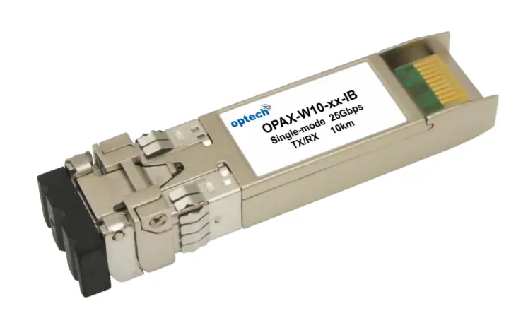
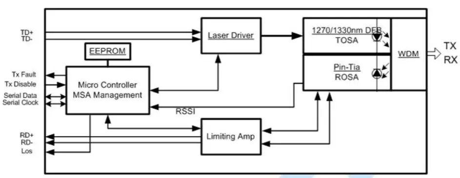

5G采用100M通道，64T64R天线时，若采用CPRI接口，带宽将达到393.216Gb/s，即便采用CPRI压缩算法，也会达到100Gb/s，而eCPRI只需25Gb/s的带宽，综合技术、成本等考虑，5G前传将采用25G速率。

2016年5月IEEE通过了802.3by-2016规范，定义了25Gb/s应用媒质接入控制参数、物理层要求，2017年12月通过了802.3cc-2017标准以太网修正：物理层和管理参数，用于通过单模光纤实现串行25 Gbps以太网，2018年10月通过PAR，开展制定10Gb/s，25Gb/s，50Gb/s单纤双向物理层规范，项目号为P802.3cp。中国于2018年6月开始制定用于基站的25Gb/s单纤双向光收发合一模块技术规范，2018年11月发出征求意见稿，预计2019年完成标准制定工作。

单纤双向方式可以节省50%的纤芯资源，大大节省了光缆线路的投资，同时由于上下行等距可有效保证高精度时间同步，因此，是5G前传的一种主要模式。

下图是optech发布的一款25G单纤双向光模块，采用SFP28封装方式：

下图是25G单纤双向光模块的原理图：

25Gbit/s单纤双向光模块采用的波长业界有1270nm/1310nm和1270nm/1330nm两种方案，征求意见稿中初步确定采用1270nm/1330nm方案。

25Gbit/s单纤双向光模块最高速率为25.78Gb/s，按传输距离分类可分为两种:

   - 中距:建议用于10km以内的场景
   - 长距:建议用于15km以内的场景

25Gbit/s单纤双向光模块光口参数分AAU侧和DU侧：

AAU侧光口参数

   - 光模块拉环为海蓝色
   - 发送端中心波长：1260nm~1280nm
   - 接收端接收波长：1320nm~1340nm
   - 平均发送光功率：10公里，-2.0 ~ +4.0dBm；15公里，0 ~ +6dBm
   - 发送和色散代价(TDP)：≤2.7dBm
   - 最大接受灵敏度：10公里，≤-13dBm；15公里，≤-14.5dBm

DU侧光口参数

   - 光模块拉环为中黄色
   - 发送端中心波长：1320nm~1340nm
   - 接收端接收波长：1260nm~1280nm
   - 平均发送光功率：10公里，-2.0 ~ +4.0dBm；15公里，0 ~ +6dBm
   - 发送和色散代价(TDP)：≤2.7dBm
   - 最大接受灵敏度：10公里，≤-13dBm；15公里，≤-14dBm

信道功率预算和代价

为了保证25G单纤双向光模块在现网中的应用,各项指标值需要保证功率预算需求,保证足够的冗余量。链路光功率预算需要考虑传输(光纤含熔接)损耗,活动连接头损耗和维护冗余等因素,光功率预算的公式如下:

$$ P_o−S_i-E≥T+I+M $$

式中:

 - $$P_o — 最小发送光功率;$$

 - $$S_i—— 最大接收灵敏度;$$

 - $$E—— 发送和色散的代价;$$

 - $$T—— 传输(光纤含熔接)损耗,1310nm 波段光纤每公里损耗按 0.4dB 计算;$$

 - $$I—— 活动连接头损耗,每个按 0.5dB 计算;$$

 - $$M—— 维护冗余,工程中维护冗余按 3dB 计算。$$

按平均发光功率的统计数据计算，得出：

  - 10km模块最大线路衰减：

$$P_o−S_i−E=4.0−2.7−(−13)=14.4dB$$

  - 15km模块最大线路衰减：

$$P_o−S_i−E=6.0−2.7−(−13)=17.4dB$$

即当光缆线路端到端衰减大于14.4dB时，应选用15km单纤双向光模块。
