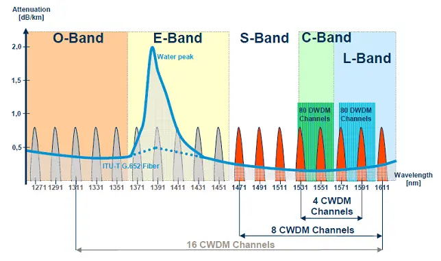
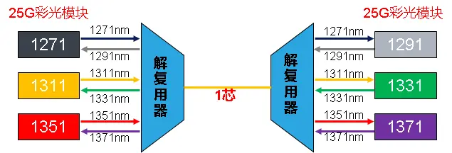
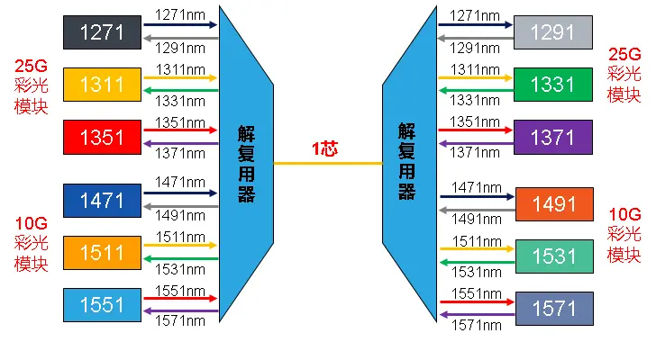
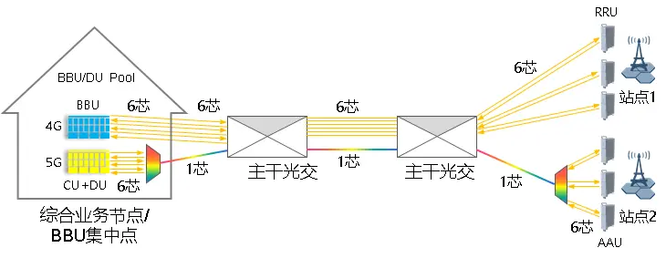
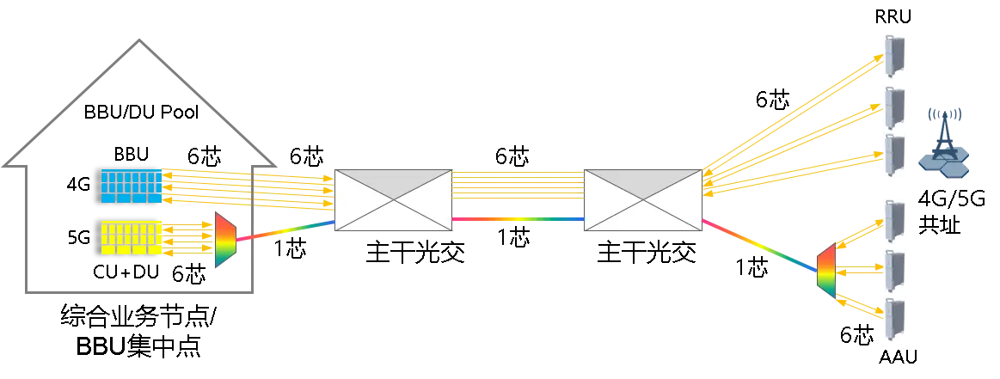
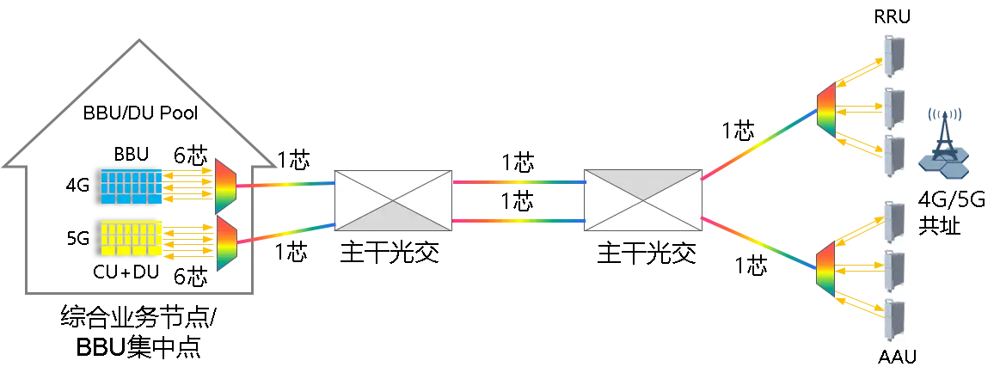
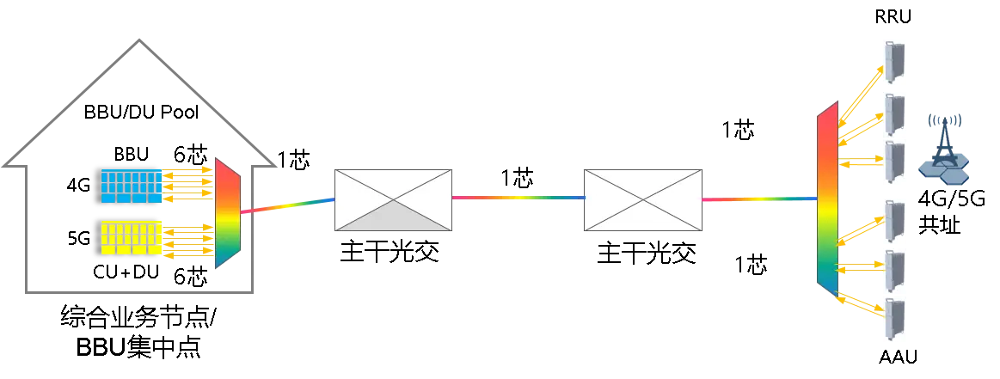
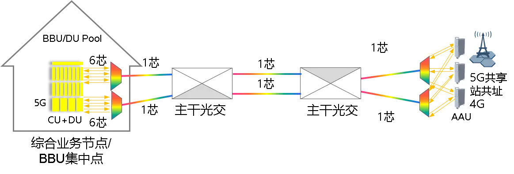
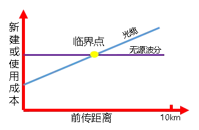
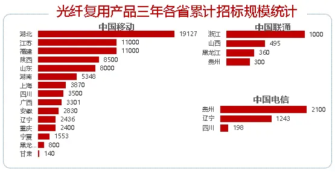

ITU-T G.694.2规范在1270~1610nm范围内，建议了波长间隔为20nm的18个可用波长，如下图所示：

由于G.652 A/B光纤有水峰，一般都用1471~1611nm这8个波，对于G.652 C/D光纤，18个波均可使用。

4G建设时期，前传主要采用光纤直驱方式，建设了大量接入主干和配线光缆。由于5G基站大量与4G共站，均有配线光缆接入，采用无源波分方式能最大化提高现有光缆的利用效能，为光缆网络增值，降低接入成本，是5G前传建设时需要重点考虑建设方式。

目前用于5G前传的无源波分方案，主要有两种方式：

 -  6波25G方案

 - 12波方案（6波10G+6波25G）

近期的上海移动5G无源波分招标，包含12波25G的无源波分方案，据推测，可能是采用移动的OPEN-WDM彩光方案，25G彩光模块前6波采用比较成熟的1271nm，1291nm，1311nm，1331nm，1351nm，1371nm，后6波选用目前较少采用的1471nm，1491nm，1511nm，1531nm，1551nm，1571nm这6个波长，后期需跟踪用于室外的12波25G彩光模块的整体成熟度和成本是否能降下来。

在目前的5G前传建设中，也有采用25G单纤双向光模块，这种方式可以看作是一种光模块集成的CWDM方式，对于减轻主干、配线光缆的压力，起了很大的作用，在纤芯不紧张时，可以采用该方式。目前共享5G的前传接口需求尚不明确，若采用2×25G接口方案时，对光缆网纤芯的需求将是2倍的需求。

针对不同的5G前传接入场景，6波和12波有不同的组合方案。

**场景1**：

  - 新建5G站址，配线光缆新建，接入主干利旧

  - 配置：无源6波合分波器×2+25G彩光模块×6

**场景2**：

  - 5G与4G共站址，有少量纤芯，4G前传方式不变，5G采用无源波分

  - 配置：无源6波合分波器×2+25G彩光模块×6

**场景3**：

  - 5G与4G共站址，有少量纤芯，4G前传采用无源波分，5G采裸光纤

  - 配置：无源6波合分波器×2+10G彩光模块×6（比场景2成本低一些，但需割接4G基站）

3.webp)

**场景4**：

  -  5G与4G共站址，无纤芯，4G、5G前传采用无源波分，腾退纤芯

  -  配置：无源6波合分波器×4+10G彩光模块×6+25G彩光模块×6

**场景5**：

 - 5G与4G共站址，无纤芯，4G、5G前传采用无源波分，腾退纤芯

 - 配置：无源12波合分波器×2+10G彩光模块×6+25G彩光模块×6

**场景6**：

 - 联通电信共享5G，与4G共址，少量纤芯，5G前传采用无源波分

 - 配置：无源6波合分波器×4+25G彩光模块×12

 - <b>假设每个AAU需要2个25G接口</b>

还有其他组合方式，就不一一列举了。总之，采用无源波分，主要目的就是腾退已占用纤芯和减少纤芯占用，对于4G前传RRU采用级联的情况，采用无源波分主要是减少5G前传纤芯占用。

根据上海移动5G无源波分的招标公告以及中标公示，6波25G无源波分限价4000元/套（不含税），平均中标折扣率为70.18%，12波25G无源波分限价10600元/套（不含税），平均中标折扣率为79%。

上海移动招标的是10公里光模块，最大线路损耗为11dB，也就是在11dB这个范围内，采用无源波分的成本是固定的，而新建光缆或使用光纤的成本和距离成正比关系，有一个成本交叉的临界点，如下图所示：

各本地网可以根据自己的情况进行测算，测算时应同时考虑主干与配线的综合成本，确定无源波分应用的最佳场景。

有关材料显示近三年各运营商无源波分招标规模如下：

在现有的采购模式下，5G基站设备的采购和无源波分的采购是两个独立的项目，但都含有前传光模块的采购内容。如果前传采用无源波分方案，那么5G基站设备采购的光模块就重复了，带来资金的浪费，建议统一由一个项目来采购前传的光模块及CWDM合分波模块，降低整体的5G建设成本。
