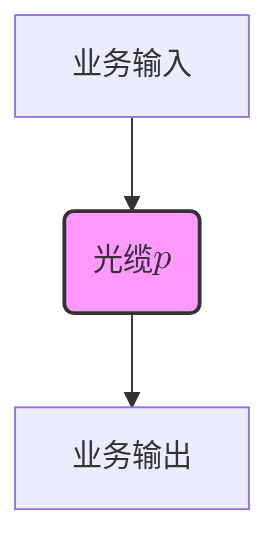
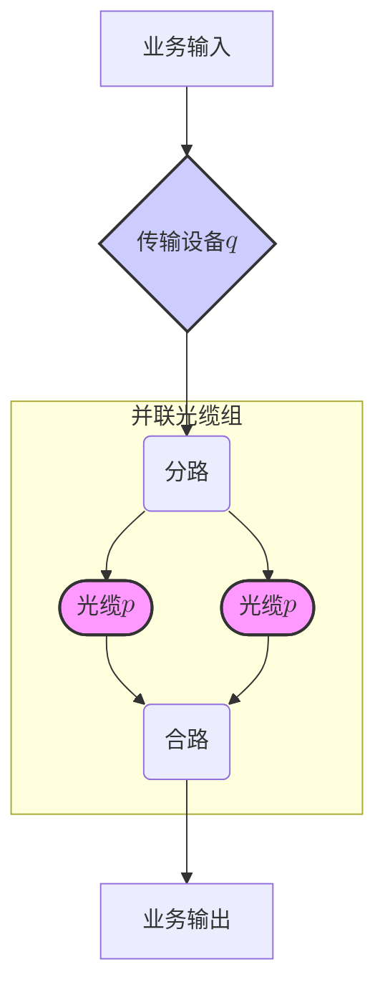

承载关键业务电路时，选择何种方式是一个涉及技术、成本与风险的重大决策。是采用 **简单直接的光纤直驱** ，还是选择 **具备冗余保护的传输系统承载** 呢？大概大部分人都会选择最“ **安全** ”的方式，就是上传输系统。

但是，是否真是这样呢？

## 核心问题：如何实现高可靠性？

我们对两种主要的承载方式进行可靠性分析，其中，可靠性（Reliability）用$R$来表示，它代表系统在给定时间内无故障运行的概率。

我们假设：

-  **光缆的可靠性**为$p$
-  **传输设备的可靠性**为$q$

### 方式 1：光纤直驱

这是最简洁的方式，电路直接通过一根光缆承载。

### 方式 2：传输系统承载

我们简化模型为： **一个传输设备** 与 **两条并联的光缆** 串联组成。

- **并联光缆的可靠性：** 两条光缆并联，只有当两条光缆同时失效时，光缆承载才失效。
    
    $$ R_{光缆并联} = 1 - (1-p)(1-p) = 2p - p^2$$
    
- **系统总可靠性：** 将光缆并联体与传输设备 $q$ 串联起来。
    
    $$ R_{方式2} = R_{光缆并联} \times q = (2p - p^2) \times q$$
    

##  可靠性的“决胜局”：谁更优？

通过数学比较 $R_{方式2}$ 和 $R_{方式1}$ 的大小，我们得出了一个**关键的临界值**，它决定了你的选择：

| **临界条件**                | **可靠性比较**                 | **决策建议** |
| ----------------------- | ------------------------- | -------- |
| 当 $q > \frac{1}{2-p}$ 时 | $R_{方式2} > R_{方式1}$       | 传输系统承载更优 |
| 当 $q < \frac{1}{2-p}$ 时 | $R_{方式1} > R_{方式2}$       | 光纤直驱更优   |
| 当 $q = \frac{1}{2-p}$ 时 | $R_{方式1} \approx R_{方式2}$ | 两者可靠性相当  |

### 临界值 $Q_{临界} = \frac{1}{2-p}$ 的分析

#### 1. 当光缆 $p$ 极高时（接近完美）

假设你的光缆质量非常好， $p = 0.99$。

$$Q_{临界} = \frac{1}{2 - 0.99} = \frac{1}{1.01} \approx 0.9901$$

这意味着，除非你的传输设备 $q$ 的可靠性**高于 99.01%**，否则方式1（直驱）的可靠性反而更高！

**解读：** 当基础的光缆本身已经足够可靠时，再引入高昂的传输设备，其带来的**故障风险 ($1-q$)** 甚至可能超过两条并联光缆带来的冗余收益。额外的投资换来的可能是可靠性的**下降**。

#### 2. 当光缆 $p$ 较低时

假设你的光缆环境较差， $p = 0.8$。

$$Q_{临界} = \frac{1}{2 - 0.8} = \frac{1}{1.2} \approx 0.833$$

在这种情况下，只要你的传输设备 $q$ 的可靠性**高于 83.3%**，方式2就会优于方式1。

**解读：** 当基础链路可靠性不足时，冗余的光缆并联结构（方式2的核心优势）可以显著提升整体可靠性，即便引入的设备风险较大，也是值得的。

### 工程抉择：投资与安全的平衡

分析结果清晰地告诉我们： **业务电路承载的可靠性选择，绝不能一概而论。**

方式2（传输系统承载）固然提供了强大的光缆冗余保护，但也带来了 **巨大的投资增加** 和 **新的故障点（传输设备 ）** 。

## 结论：最贵的，不一定就是最好的

构建高可靠性的通信网络，需要从 “可靠性” 和 “投资有效性” 两个维度进行评估。

我们应该避免用巨大的、不经济的投资，去换取微量的安全提升。只有通过精确的数学模型分析和对具体工程环境（$p$ 和 $q$ 的实际值）的深入理解，才能找到真正符合业务需求、且最具成本效益的承载方案。

> 最可靠的方案，是平衡了成本与风险的方案。

